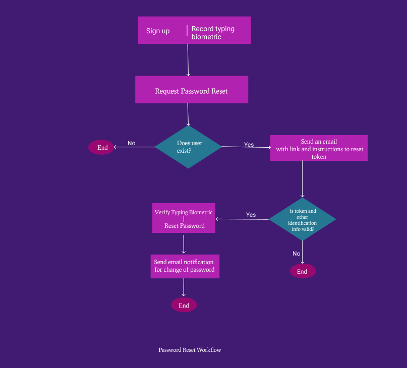

# Secure Password Reset 

This is a password reset sample project

Workflow



Follow the tutorial [here]("") to learn the implementation

Setup

Run `npm install`

create a `.env` file and add the values of the variables there

```shell
BCRYPT_SALT=10
EMAIL_HOST=
EMAIL_USERNAME=
EMAIL_PORT=
EMAIL_PASSWORD=
FROM_EMAIL=
DB_URL=mongodb://127.0.0.1:27017/testDB #you can use a connection string from Mongodb.com incase you don't have Mongodb installed on your machine
JWT_SECRET=mfefkuhio3k2rjkofn2mbikbkwjhnkj
CLIENT_URL=localhost://8090
TYPINGDNA_USERNAME= #Your TypingDNA API key
TYPINGDNA_PASSWORD= # Your typingDNA API secret
```

Then run `npm start` 

Go to signup -> http://localhost:8080/signup


